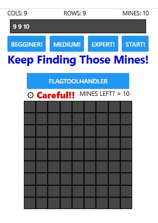
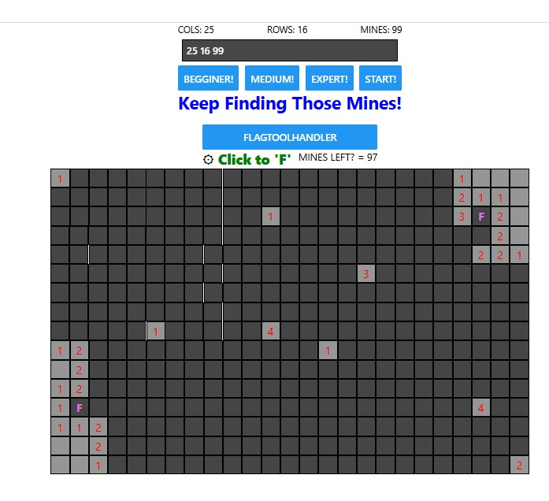

### HOW TO RUN?

```Prerequisites
We'll need the following to get started:

Expo Go installed on a physical device
Node.js (LTS version) installed
VS Code or any other preferred code editor or IDE installed
A macOS, Linux, or Windows (PowerShell and WSL2) with a terminal window open
The tutorial assumes that you are familiar with TypeScript and React. If you are not familiar with them, check out the TypeScript Handbook and React's official tutorial.
```

- https://docs.expo.dev/tutorial/create-your-first-app/
- npm run web (this is what I use)
- npx expo start

### React native expo Pictures from Minesweeper



In web browser using dev tools game does not allow you to move field left or right, but it is possible on andriod device.



# ----------------------------------------------------------

### TODO:

- Create Snake Game using React Native!
  - Currently snake game is rendered using text. But it needs ReactNative game engine.
